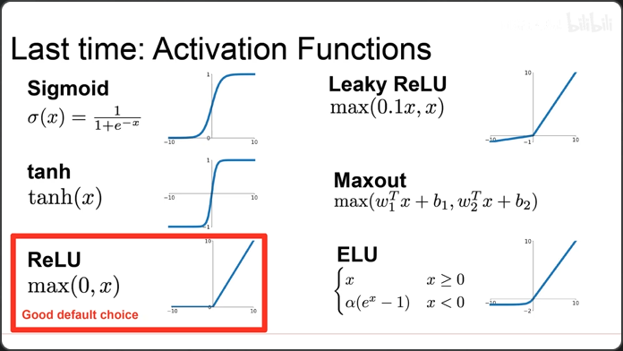
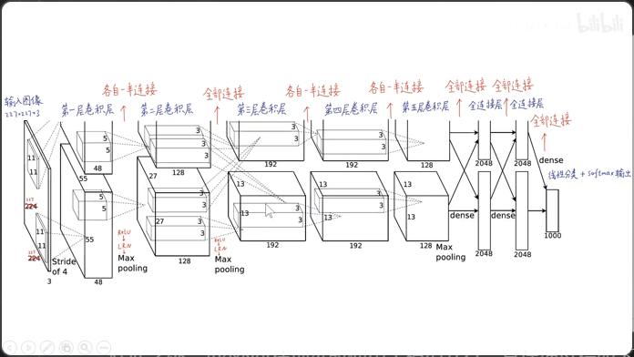
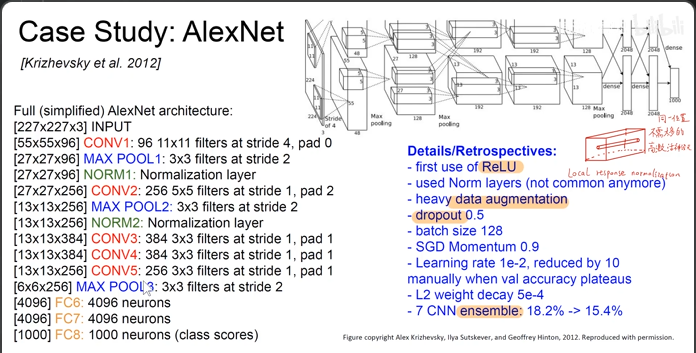
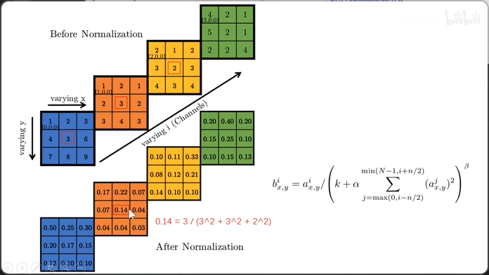
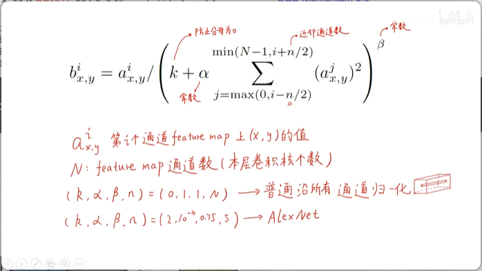

# AlexNet网络论文笔记
* 论文的中文译文版可以参考 https://blog.csdn.net/hongbin_xu/article/details/80271291
> 本文主要内容来自B站同济子豪兄论文精讲系列视频
## 概述
AlexNet是2012年ImageNet图像竞赛全项冠军，其首次将深度卷积网络应用到大规模图像分类上，使得准确率相比之前模型有了巨大的进步，也是后面无数模型的基础。虽然准确率已经无法与后面的模型相比，参数量也称不上少，但是AlexNet奠定了计算机视觉模型的方法和模型训练的技巧。
## 深度卷积神经网络
卷积核的对应位置称为感受野，卷积核和感受野卷积后生成feature map；
池化层（下采样层）：平均池化/最大池化，可以去噪；ReLU激活函数:其相对于sigmoid和tanh这样的饱和激活函数，可以加快学习速度，减少梯度消失的可能性，其详细表达如下： 
 
除此之外，AlexNet在训练时使用了模型并行，其详细过程如下: 
 
把神经元放在两个GPU上进行训练，仅在第二层卷积层后和全连接层处两个GPU可以相互通信，除此之外其他神经元独自训练，网络中所有激活函数都使用ReLU函数，池化使用最大池化（重叠最大池化）同时第一二卷积层还使用了LRN层（但是此层被VGG证明并没有明显的作用）；在训练中发现两个GPU训练出的卷积核效果并不一样并有明显侧重点
> http://scs.ryerson.ca/~aharley/vis/conv 
 在线lenet手写数字识别网络过程可视化体验

## AlexNet的基本结构和参数
 
## 局部响应归一化操作(LRN) ~~已经证明了真没啥用~~
 
可以使神经元不需要进入高激活状态，因为一旦神经元高激活会抑制附近的神经元的训练，其详细处理公式如下:
 
其中k，α等超参数是AlexNet通过实验得到的一组参数，论文作者认为使用这一手段可以防止过拟合并且与生物神经元的结构相似
## 重叠最大池化 ~~这个也没啥用，后续不用了~~
池化时如果步长小于池化窗口尺寸，每个窗口移动之间会产生重叠，AlexNet认为这一手段可以防止过拟合
## 防止过拟合
数据增强：对每一张图片进行了水平翻转，随机裁剪的手段以扩充数据集，防止过拟合；除此之外，AlexNet还采用了RGB颜色变换，使用了PCA主成分分析求出了RGB3×3协方差矩阵的特征值和特征向量，对颜色在出成分上增加了随机变换；同时还使用了Dropout(很基础的东西，不多写了)

> 因为模型基础且论文很短，很多方法还被后续证明是无效的，故不作论文分段分析；其数据结果部分体现了深度卷积神经网络比常规的机器学习方法在图像分类问题上具有明显的优越性；关于模型并行的侧重问题和PCA主成分分析图像增强问题，可以自行参照论文对应部分

  
> 本笔记由balmung08(github)整理

