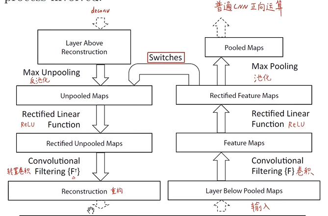
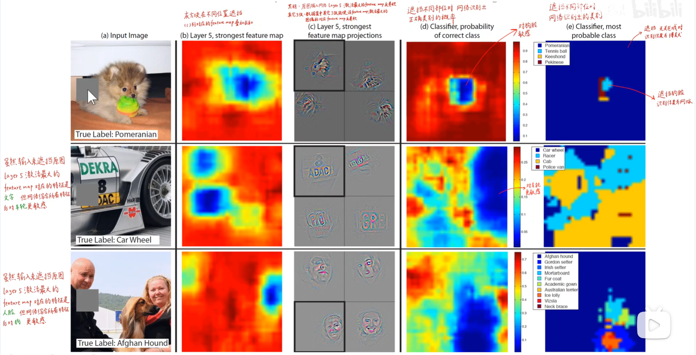

# ZFNet网络论文笔记
> 本文主要内容来自B站同济子豪兄论文精讲系列视频
## 概述
ZFNet是ImageNet2013年分类亚军，给出了可视化卷积神经网络中间层的方法，使得我们可以知道神经网络提取了什么样的特征并以此改进之前设计的网络，其网络结构本身只是对AlexNet的小修改，本身最有价值的地方在于可视化方法，以及对卷积网络的可解释性分析

------------------------------------
## ResNet论文分析
* Abstract
> * 提出了可视化技巧用于改进网络的结构，并借此改进了AlexNet，同时发现了模型迁移学习的优秀效果
* Ⅰ.Introduction
> * 大规模的数据集；计算机的硬件算力；模型的算法改进三点共同推进神经网络模型的发展。但是如果没有能够解释神经网络的方法，训练就成了完全的碰运气，因此尤其需要一个可视化方法用于观察模型的演化。此论文使用了反卷积（转置卷积）方法作为将feature map投射回图像空间的方法便于人的观察。同时本文还做了局部遮挡的敏感性和相关性分析。使用可视化技巧改进了AlexNet并作了泛化
> 1. Related Work
> * 传统方法无法对高层CNN特征进行可视化也无法探索CNN的平移缩放旋转的不变性；以往的可视化分析仅局限于难度较低的第一层卷积层分析，这很明显是不够的
> 2. Approach
> * 以常规卷积网络为例（图像输入到softmax输出特征向量,随机梯度下降加交叉熵损失函数训练） 
 
>> 1. 反卷积（转置卷积+反激活+反池化）
>>> 首先将图像喂进网络得到feature map，然后将除了此feature map以外所有的feature map激活全部设为0并进行反卷积
 
>>> * 反池化：在池化时就记下最大值的位置，反池化时给到原来的位置，把其他位置设为0；但是不可避免的会丢掉非最大像素的信息 
 
>>> * 反激活：仍然使用ReLU函数就完了，为保证feature map转换均为正值，那么反向卷积也用ReLU起到同样的效果
>>> * 反卷积：使用原始正向卷积核的转置，因此在整个过程中完全没有需要学习的参数，能够保留输入图像的主要特征和主要矛盾。亮暗的轮廓就可以体现feature map反应的特征
> 3. Training Details
> 使用ImageNet训练集，不再进行模型并行；将原图缩放到短边256像素，crop出中间256×256像素，像素减去均值并将其四个角和中间取出224×224图像再做水平翻转，得到了十张不同的增强图像；使用随机梯度下降，mini-batch取128像素并使用Dropout；权重项全部初始化为0.01，偏置项初始化为0；如果第一层卷积核均方根误差过大，则将之裁剪到均方根误差较小的情况
> 4. <b> Convnet Visualization </b>  
 
> * 图像很小，要去论文中仔细观察一下 
> * 卷积核反卷积出的图片和能使上面九个卷积核激活最大的数据集中的原图top9，可以观察到特征和原图的高度相似性
> * 底层网络提取边缘，颜色；中层网络提取形状；高层网络提取物体；特征越来越复杂和特化；另外，网络越深，特征越关注语义信息，网络越浅，越关注空间信息，因此网络越深，特征的不变性越强
> * 网络的底层收敛越快，高层收敛越慢 
 
如果图像发生突变，说明能使卷积核最大激活的原图片发生了变化
> * 变换不变性分析 
 
> 变换对底层影响显著，对高层影响很小，同时网络对平移缩放相对不敏感而对旋转敏感，但是旋转至90度的倍数时因为对称性，识别的准确率较高
>> 1. Architecture Selection
>> * 对AlexNet的一定改进：AlexNet的第一层卷积层经常提取出过高过低频的无效信息和网格等人工信息，因此降低卷积核的大小，从11×11变成7×7，并减少步长从4变成2
>> 2. Occlusion Sensitivity(局部遮挡敏感性分析) 
>> 网络关注图像的关键部位以判断物体的种类；如果遮挡住feature map在图像中对应的部位，准确度会显著的降低 
 
>> 3. Correspondence Analysis(图像局部相关性分析)
>> * 比如说眼睛和脸的关系，神经网络实际上是隐式相关：即实际上是相关的，但是并没有外在体现 
 
可以看出，遮相同部位的差别小于随机遮挡，而网络越深，遮挡的影响越小，再度说明了隐式相关和深层网络提取语义信息这两个结论的正确性
> 5. Experiments
> * 说明了本模型的改进切实有效，并且泛化学习的效果很好
> * FC和卷积核的数量过多会导致过拟合
> * 在数据集上从头训练的效果通常远远不如在大数据集上训练的模型做泛化学习（两个数据集的种类不能相差太多）
> * 层数越深，其提取的特征对分类的有效性越高，此现象支持了特征是分层的这一说法，并再次支持了深层模型提取语义特征的结论

## 总结
本论文的模型实际上并没有什么创新，但是其特征可视化为以后的可视化与可解释性分析做了良好的开端，同时思路也很值得参考
  

> 本笔记由balmung08(github)整理

