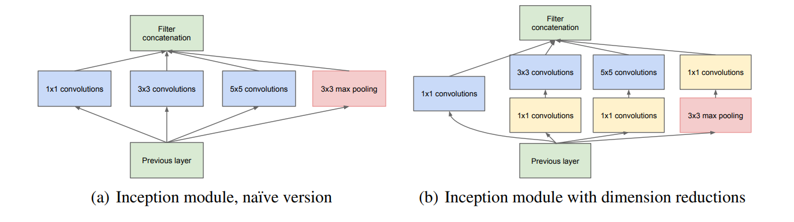
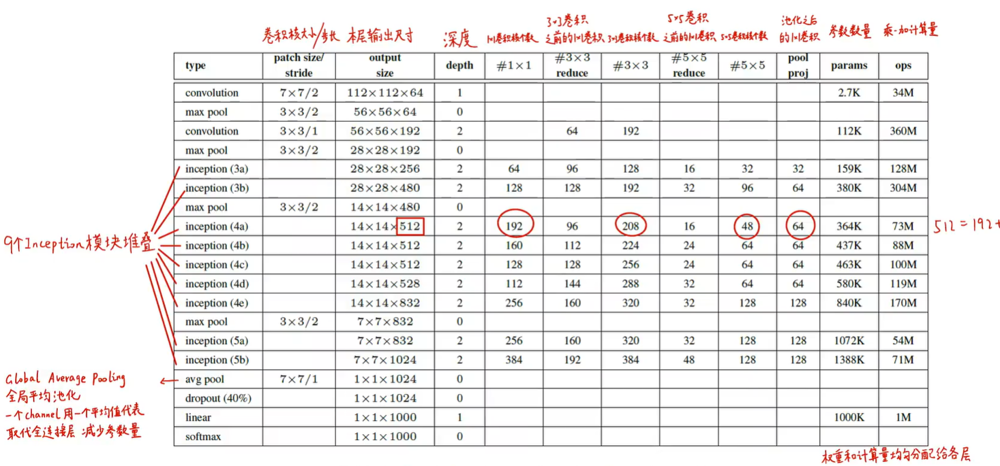

# GoogLeNet论文笔记
> 本文主要内容来自B站同济子豪兄论文精讲系列视频
## 概述
GoogleNet模型是2014年ImageNet图像竞赛分类与检测冠军。在2014年里，其模型性能与VGG一同达到了人类的水平，且参数量比VGG要少的多，可以更容易的部署到各种边缘计算设备上

---------------------------------
## GoogLeNet论文分析
* Abstract
> * 充分利用网络的计算资源，在保证性能，增加网络深度和宽度的同时减少了参数量和计算量；使用了多尺度信息处理（不同尺寸的卷积核)
* Ⅰ. Introduction
> * 不仅得益于硬件、数据集和模型尺寸，深度学习的进步还来自与各种新的模型思路和模型结构
> * 随着移动设备和嵌入式的发展，模型的计算量和效率显的尤为重要，不能一味的增加深度
* Ⅱ. Related Work
> * Inception模块1×1卷积的作用：升降维、减少计算量和参数量、增加网络深度，提高非线性表达能力
> * 以RCNN代表的两阶段方法；找出所有可能的候选区域然后再对每个区域运用CNN，兼顾底层和深层特征
> * 提出了增加候选框中包含真目标的比例，即候选框的准确度
* Ⅲ. Motivation and High Level Considerations
> * 提高模型性能的传统方法：增加深度，即模型的层数；增加宽度，即卷积核的个数；这样的弊端是可能带来大量的参数，很容易出现过拟合（尤其在小数据集和不好标注的数据集上）；除此之外，计算量会极大增加，且如果其中一部分权重训练出来为0，则该部分算力完全被浪费而起不到效果；由此我们需要兼顾计算的效率和精度
> * 使用稀疏连接取代密集连接
> * <b>关于稀疏矩阵分解和硬件利用加速请参照原文</b>
> * Inception模块的实际原理还有待进一步的探索，如果可以用AI设计网络结构并多个设计都包含Inception模块，则说明模块起效
* Ⅳ. Architectural Details
> * Inception：GoogLeNet就是前几层用正常的卷积层，后面全部用Inception堆叠而成
> * 经过作者仔细的测试，Inception在定位和检测任务上很有用，Inception堆叠出的网络结构至少可以达到局部最优 
 
> * 原始版本：四个分支，每个分支卷积后的feature map分辨率大小是相同的，于是就可以将其堆叠起来（通道堆叠），作为下一层的输入（卷积核尺寸可以更改）
> * 使用了padding对齐的方法保证不同卷积核处理后图像的尺寸不变
> * 原始版本的问题：池化分支的输出和输入维度完全相同，拼接额外的卷积层之后会导致输出通道数（层数）变得越来越大，由此导致后面的卷积核计算量越来越大
> * 降维版本：在卷积层的前面、池化层的后面加1x1卷积降维，这样做第一可以使维度变得可控，减少后面的计算量（即使被降维成低维度了也可以包含大量的信息），第二和VGGNet的解释一样，加入的1x1卷积层后增加的ReLU激活可以增加网络的非线性表达能力
> * <b>不能一开始就用Inception模块，在一开始需先用主干网络</b>
> * 采用Inception结构的好处：可以自己控制每一层的卷积核个数，从而使得模块输出通道数可控，计算复杂度不会发生爆炸；此结构的每个分支从多个尺度抽象出特征，这又与多尺度提取视觉信息相符；比结构相似但没有采用Inception结构的网络快2到3倍
* Ⅴ. GoogLeNet
> GoogLeNet的模型结构如下:
 
[GoogLeNet模型结构流程图（过长折叠）](./pic/3.png) 
> * 权重和参数较平均到各个层而不像VGG全在第一层FC层
> * 使用全局平均池化代替展开和两层FC层
> * 有两个辅助分类器，在反向传播过程中会将辅助分类器的loss乘以0.3的权重再加到总loss中，注意辅助分类器在预测阶段不会使用
> * 增加两个辅助分类器的作用：增加低层网络的分类能力；防止梯度消失；增加正则化
> * <b>实际上LRN层和辅助分类器都在后续证明了没有明显作用，后来一般都不使用了。</b>
* Ⅵ. Training Methodology
> * 可能有用的方法:多尺度采样（注意这里是训练时，和预测时不一样）从原始图片裁剪出用于训练的图片，裁剪出的尺寸大小从8%到100%的均匀分布随机选择一个，纵横比从3/4和4/3随机选择一个；光度失真；随机选择插值
* Ⅶ.ILSVRC 2014 Classification
> * 没有使用额外的数据
> * 采用七个模型集成，其中六个模型的网络结构、初始化方式、学习率调整策略完全相同，仅仅是采样方式不同（是作者的失误）
> * 和VGGNet一样，要解决AlexNet尺度单一的问题：在预测时，将图片缩放到四个尺度，短边分别为256、288、320、352，再取三个正方形（上中下或左中右），每个正方形再取四个角落和中心和原图片直接缩放到224 x 224，还有这些图片的镜像（总图片数：4x3x6x2）
> * 真实使用不需要数据增强到这个地步，并且裁剪过多会达到性能瓶颈
> * 在多个裁剪和多个分类器的softmax概率结果求平均得到最终的预测结果（作者尝试了在多个裁剪上最大池化+多个分类器求平均发现效果并不如简单的求平均）
* Ⅷ. ILSVRC 2014 Detection
> * 如果算法给出的框分类正确且与正确标签框的交并比（IOU）大于0.5，就认为这个框预测正确
> * 结合Selective Search和multi-box prediction，减少了无用的候选框；没有使用bounding box regression而是直接对候选框分类（时间紧）；使用Inception模型作为分类器

  

> 本笔记由balmung08(github)整理
