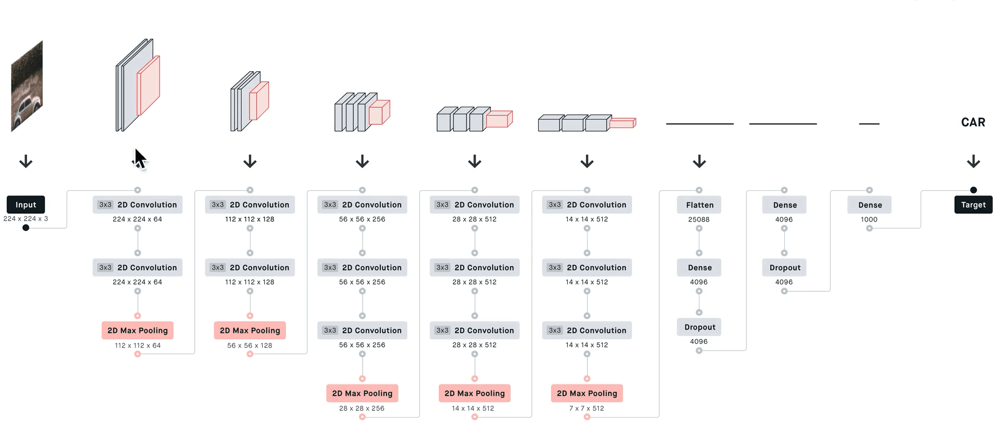
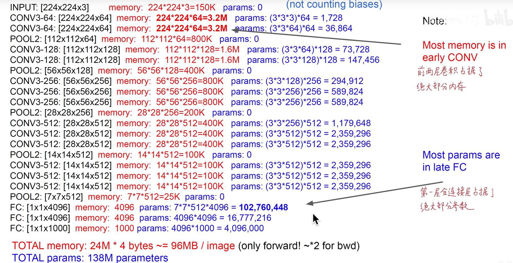
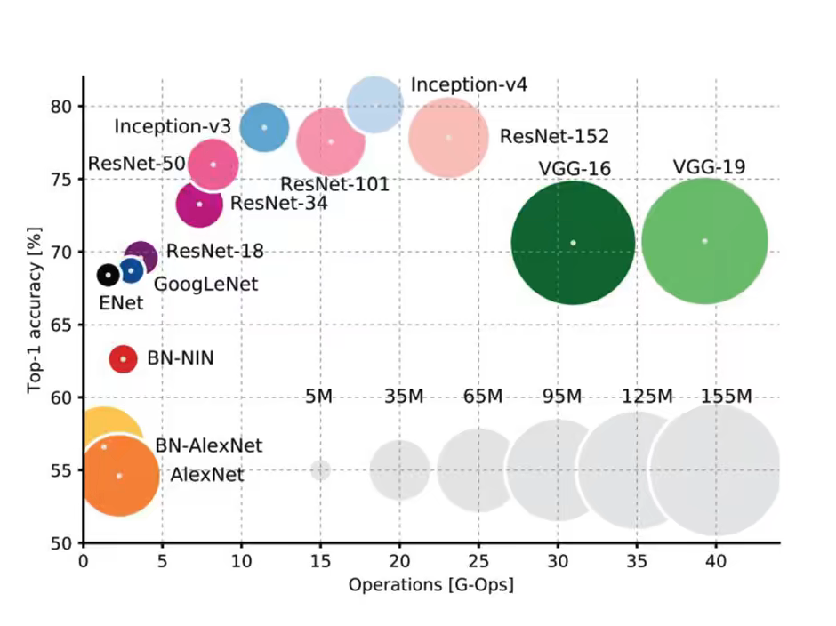
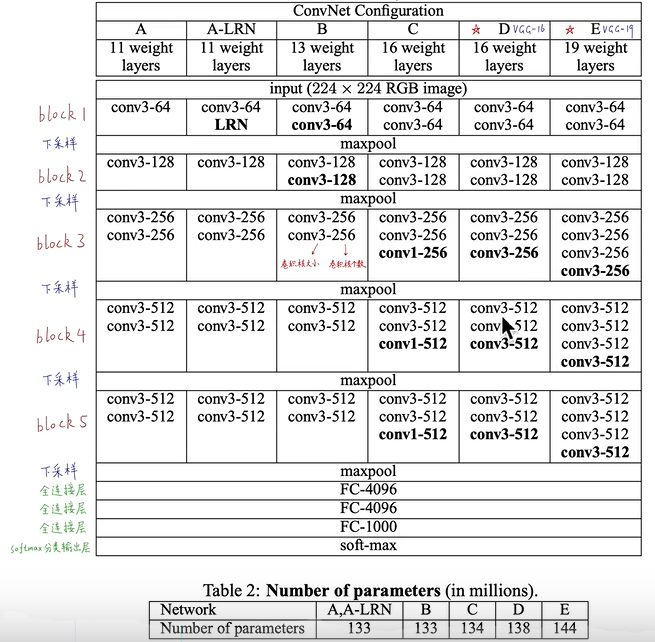
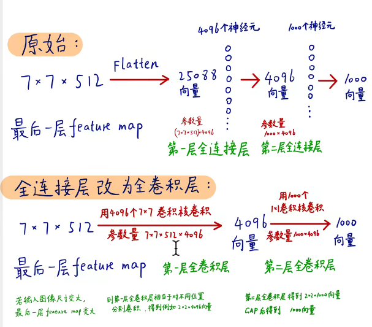
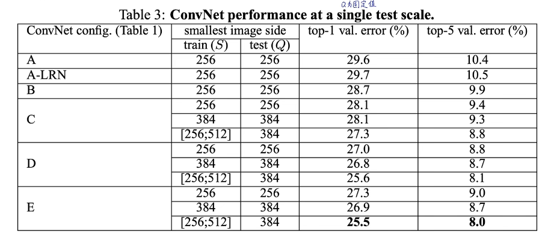
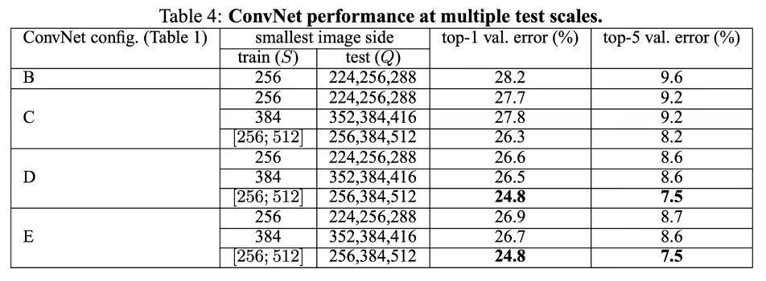
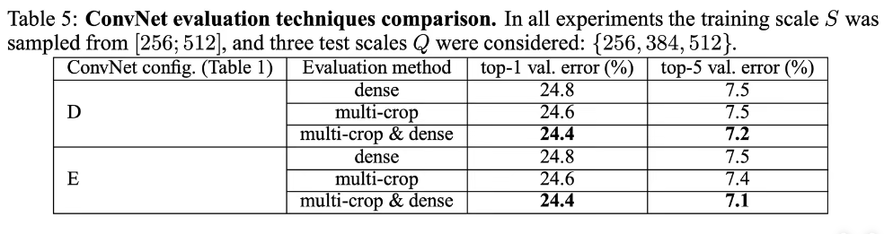
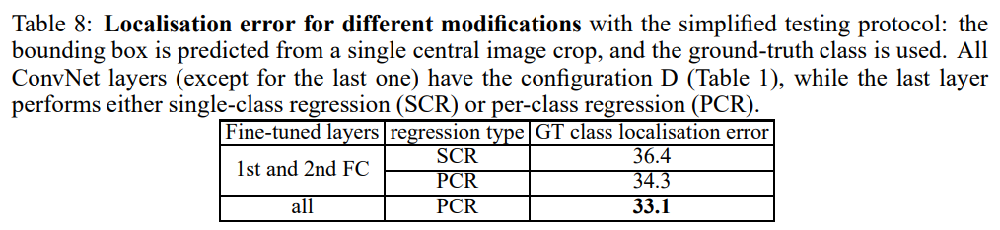
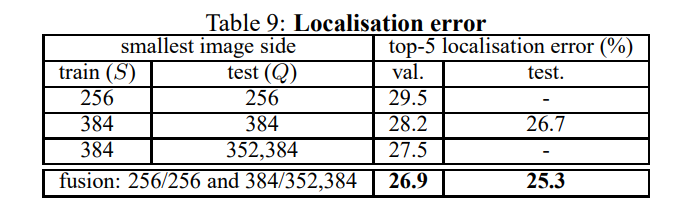

# VGG网络论文笔记
* 我认为VGG是每个DL学习者都应该学习并理解的网络
> 本文主要内容来自B站同济子豪兄论文精讲系列视频
## 概述
VGG模型是2014年ImageNet图像竞赛分类亚军与定位冠军。其基本上是传统的卷积神经网络在深度上能达到的极致，如果想加深网络结构，则需要改进结构而不能使用传统串行结构。其特征提取方式也被广泛使用于后面出现的不少新模型中。
### VGG16网络的基本结构 
 
> 一点补充：卷积核的层数等于输入的通道数，卷积核的个数等于输出的通道数，同时池化层（下采样层）有meanpool和maxpool两种，顾名思义是在池化时取均值或最大值的两种做法
其基本采用的是22333的分段结构，最后加上全连接层和softmax分类层。
### VGG16网络的内存与参数情况
VGG16结构简单清晰，但是由于参数个数过于庞大导致模型的效率受到限制。下面给出模型的内存使用和参数情况： 
 
由图形可知模型主要内存消耗于前两个conv层，而参数数量在第一fc层达到极致的臃肿。注意，图中仅考虑模型部署后的前向传播，在训练时反向传播的梯度参数还要额外占用更大的内存。
### 为什么VGG16使用3*3的卷积核
两层3×3的卷积核在输出上可以代替一层5×5的卷积核，在得到一样输出的情况下有如下好处：
* 模型深度变深，因此非线性次数更多，模型学习效果更佳
* 两层3×3的卷积核的参数远小于一个5×5的卷积核的参数数量
> 3×3的卷积核是最小的全向卷积核，三层3×3的卷积核也可以替代一个7×7的卷积核并且仍然具有上述优点
### VGG模型的特点
准确度处于模型中等水平，但是参数臃肿，其对参数的利用率很低。概览如下： 
 
> 说明：横轴为一次推断的前向传播的计算量，纵轴为结果准确度，圆圈大小为模型的参数数量，因此模型越靠左上且圈越小模型的效果越好
---------------------------------
## VGG论文分析
* Abstract
  > * 3×3的卷积核在16-19层网络中取得了显著的效率提升 
  > * 模型提取出的特征可以泛化到更多的数据集上（说明特征提取功能优秀）
* Ⅰ.Introduction
  > * 在AlexNet的基础上做出改进：在第一卷积层使用更小的感受野与步长，或<b>密集全图</b>训练测试与缩放图像训练。在算法和数据集训练方式两个方向改进了网络性能。 
  > * 固定其他要素而增加深度，精度随之增加
  > * VGG作为特征提取器，自训练简单的分类器直接分类输出的4096维向量是VGG常用的迁移学习手段
* Ⅱ.Convnet Cconfigurations（模型结构）
  > 1. Architectrue
  > * 训练阶段使用图像为固定尺寸224×224的图像，做RGB均值预处理： 每个像素减去此图像的均值，即将均值拉成0方便拟合 
  > * 所有的卷积核均为3×3卷积核（最小全向卷积核），在其中一个实验中使用了1×1的卷积核
  > * 所有卷积核步长为1，为保证图像尺寸不变使padding=1（补一圈0）
  > * 下采样共使用了五个最大池化层，窗口为2×2，步长为2，可以使得图像尺寸变为原来的一半
  > * 伴随不一样的卷积层数后接三层FC层，4096-4096-1000，经过softmax层后输出一千种类的概率值
  > * 激活函数使用ReLU，且证明了LRN层对模型的准确度并没有正面影响且会消耗额外的算力
  > 2. Configurations 
  
  > * 上表为VGG网络对照实验的几个网络结构和参数量
  > 3. Discussion
  > * 相比大卷积核和步长，小卷积核与小步长可以与图像中每一个像素都进行卷积，其对模型的特征捕捉更加完善，同时小卷积核层数叠加在感知域上没有损失同时还增加了深度
  > * 为什么使用几个小卷积核代替大卷卷积核：深度增加，模型非线性层增加，表达性增加同时减少参数。3C个3×3卷积核的参数为27C^2，C个7×7卷积核的参数为49C^2。同时还可以起到正则化的作用以防止过拟合
  > * 表中C模型使用了1×1卷积核，相当于增加非线性而不影响特征图尺寸，其本质上为线性变换加非线性激活函数。其实还可以起到升降维作用，但是VGG网络未使用此特性
* Ⅲ.Classification Framework 
  > 1. Training
  > * 从多尺度的图像裁出了很多crop
  > * 训练时使用多分类交叉熵损失函数
  > * 带动量(momentum)的mini-batch随机梯度下降优化器，动量取0.9，batchsize取256
  >> 权重衰减:对代价函数增加一个正则化项，损失函数计算梯度下降时就要同时满足原损失函数和正则项的权重同时等于0，压缩了解的空间，即对权重w的可能的取值做了限制，一定程度上可以避免过拟合
  >> __________________
  >> mini-batch:小批的梯度下降，这种方法把数据分为若干个批，按批来更新参数，这样，一个批中的一组数据共同决定了本次梯度的方向，与一个一个读样本相比下降起来就不容易跑偏，减少了随机性。另一方面因为批的样本数与整个数据集相比小了很多，计算量也不是很大
  >> __________________
  >> momentum：可以理解为梯度带上了一定的积攒的历史梯度，则如果梯度在某点处徘徊，带动量可大幅减少振幅 
  > * 全连接层引入dropout和L2正则，即权重衰减，dropout率为0.5
  > * 初始学习率为0.01，当验证集准确度基本上不提升时，将学习率除以10。最终在74 epochs时收敛
  > * 网络初始化很重要，若初始化不好会引起梯度消失或梯度爆炸，训练时先训练了一个浅模型，然后将浅模型的参数用于前三层卷积和FC层，然后在正态分布里随机初始化其他卷积层。
  > * 使用水平翻转和随机的RGB颜色变换来进行数据增强
  > * 将训练图像进行各项同性缩放，S为图像缩放后的尺寸。然后将此图像中截取一个224×224的部分，根据原图尺寸可能为全图或图像的一部分。方案一：S为固定值。方案二：允许S在一定范围内随机变化（256~512），多尺度训练，一定程度上起到了图像增强的作用。
  >> 各向异性缩放：不管图片的长宽比例，管它是否扭曲，全部缩放到CNN输入的大小
  >> __________________
  >> 各项同性缩放：因为图片扭曲后，估计会对后续CNN的训练精度有影响，有两种办法：
  >> * 先扩充后裁剪：直接在原始图片中，把bounding box的边界进行扩展延伸成正方形，然后再进行裁剪；如果已经延伸到了原始图片的外边界，那么就用bounding box中的颜色均值填充
  >> * 先裁剪后扩充：先把bounding box图片裁剪出来，然后用固定的背景颜色填充成正方形图片。
  > 2. Testing
  > * 首先确定一个测试尺度Q，网络在图像上密集的进行预测：将全连接层转换为卷积层，模型变为全卷积网络。由此Q可以为任意尺寸，若Q等于224，其与原模型相同，但是若Q较大，其输出可能为一个class score map，输出向量可能不为1×1×1000，而是n×n×1000，输出时将每一个Channel作为一个类别，每一个通道内部像素点求和平均（全局平均池化），将输出向量转为正常1000输出作为概率。然后将图像水平翻转再操作一边算出softmax后验概率，均值作为final score。
  > * FC转Conv的具体方法： 
     
    全卷积网络以后网络可以接受任何尺寸的图片，因此在图片中采crop局部样本为非必要，但是如果使用也可能提高准确度。
  > 3. Implementation Details
  > * 原本实验代码在caffe基础上完成。GPU数据并行计算，将每个batchsize分为4份，每份56个给到四个不同的GPU计算梯度，最后将梯度汇总取均值，这样可以使batch取到更大的值。计算同步，这样与单个GPU计算有相同的结果。
  >> 除数据并行以外，还有模型并行的多GPU计算方法
* Ⅳ. Classification Experiment
  > 使用数据集ILSVRC-2012，评估指标top1/top5 error双指标。该数据集测试集标签隐去，提交数据后服务器判断，因此只能以验证集作为测试集。
  > 1. Single Scale Evaluation（Q为固定值）
  > * 单个模型的情况：图像设置为若S固定，Q等于S，若S变动，则Q等于S的范围中值,其结果如下： 
     
    得出结论：LRN层在模型中没有明显作用；随着深度增加，准确度增加；使用1×1卷积核的模型C差于使用3×3卷积核的模型，虽然C的卷积层数多，引入了更多的非线性，但是1×1卷积核无法完全提取特征；模型在深度达到19层时性能达到饱和，再增加层数反而性能下降（Resnet在论文中提到并解决了这个网络退化问题）；深层小卷积核性能优于浅层大卷积核；变动的图像输入有助于提高准确度
  > 2. Multi-scale Evaluation（Q为变动值）
  > * 单个模型的情况：图像设置为若S固定，Q为S与S±32三个值，若S变动，则Q取S的两个极值与中值共三个值（Q与S不能相差太远不然影响模型的准确度），其结果如下： 
     
    得出结论：Q为范围值性能进一步优于Q为固定值
  > 3. Multi-crop Evaluation 
     
    得出结论：multi-crop和dense evaluation确实起到了互补的作用
  >>multi-crop，即对图像进行多样本的随机裁剪，然后通过网络预测每一个样本的结构，最终对所有结果平均；dense evaluation即为密集的全卷积层模型。multi-crops相当于对于dense evaluation的补充，原因在于，两者在边界的处理方式不同：multi-crop相当于padding补充0值，而dense evaluation相当于padding补充了相邻的像素值，并且增大了感受野
  > 4. Convnet Fusion（多模型集成）
  > * 模型集成的标准为好而不同，互补以达到更好效果
  > 5. Comparison
  >> ~~果然大佬们也免不了捧一踩一啊~~
  > * VGG是遵循从LeNet定下的CNN传统逐层串行堆叠结构所能达到的深度和性能的极致
  > * VGG多模型集成的提升效果很小（比如相比于GoogleNet）~~可能是训练出的模型仍然具有高度相似性~~（存疑）
* Ⅴ.Conclusion
  > VGG的深度更加深，其特征提取效果好于浅层模型，也更便于迁移，可以很容易的迁移到其他数据集
----------
* Ⅵ.Location 
  定位数据集仅需考虑一个物体的类别和位置，是一种特殊的目标检测
  > 1. Localization Convnet
  > * 最后一层卷积层改为预测bounding box的坐标，包含中心点xy，w，h。SCR（不定类回归）仅需输出4维向量，PCR（特点类回归）需要输出4000维向量
  > * 损失函数惩罚偏移欧式距离，即坐标差的平方和
  > * 两种测试方案：①假设分类完全正确，仅关注模型的回归定位能力 
  ②单模型：将空间中近似的预测框合并，然后根据分类给出的概率评级 
   多模型：多模型预测框取并集后合并分级
  > 2. Localization Experiment
  > * 首先通过①选择最优超参数，然后用于②
  > * 如果一个预测框和标准的交并比(iou)大于0.5，该预测框被认为是正确，由此生成混淆矩阵。通过看定位准确度的正确比来判断定位模型的性能 
  认为分类全部正确得到的实验数据： 
   
  在真实数据集上得到的实验数据： 
   
  得出结论：在真实条件下性能甚至优于理想条件下；VGG中PCR性能优于SCR，同时fine-tuning所有层后效果更好
  >>fine-tuning的过程其实就是用训练好的参数（可以从已训练好的模型中获得）初始化自己的网络，然后用自己的数据接着训练
* Ⅶ.Generalization（泛化） 
  > * VGG不能直接在小数据集上使用，VGG的表示能力过强，可能引起过拟合。可以以在ILSVRC数据集上预训练的模型来做泛化学习。VGG仅用于特征提取，其生成的4096维向量可能已经在高维空间中线性可分。训练仅更改最后几层FC层。
--------------------------------
## 模型总结
* 训练时使用多分类交叉熵损失函数
* 带动量(momentum)的mini-batch随机梯度下降优化器
* 全连接层引入dropout和L2正则，即权重衰减
* 收敛速度较快
* 为防止ReLU函数因为小于0均为0的特点在一开始的epoch里熄火，使用从正态分布里随机的数作为初始化参数。
* 使用不同尺度图像训练可以得到更好的效果
* 使用水平翻转和随机的RGB颜色变换来进行数据增强
* FC转全卷积提供任意尺寸输入支持
* 定位采用欧式距离损失函数，以分类网络作初始化并微调所有层
* 经典模型结构，小感知野，多层多非线性
* Depth matters!
  

> 本笔记由balmung08(github)整理

