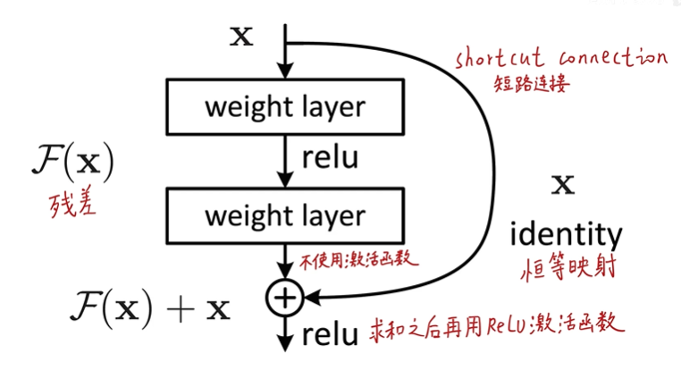
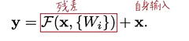
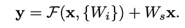
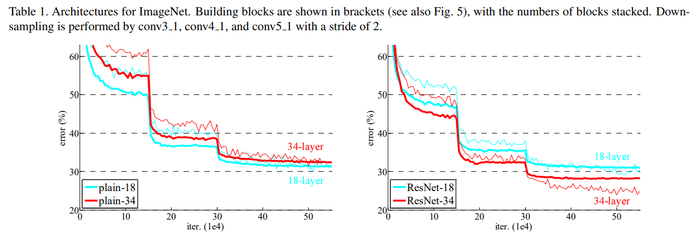
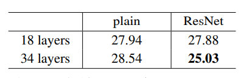
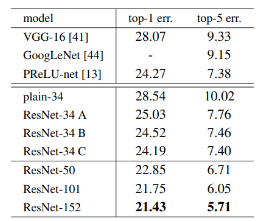
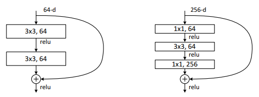

# ResNet网络论文笔记
* 论文的中文译文版可以参考 https://blog.csdn.net/wspba/article/details/57074389
> 本文主要内容来自B站同济子豪兄论文精讲系列视频
## 概述
ResNet模型是2015年ImageNet图像竞赛全项冠军，其首次在准确度上超过了人类的水平，同时其解决了网络退化问题（ResNet的深度是152层，远大于GoogleNet的22层和VGG的19层，网络可以提取出更深的特征），使得网络深度可以进行更多的叠加，使神经网络可以适应于更多的情况。
## ResNet的残差模块 
 
通过将输入恒等映射到输出，使得神经网络的拟合只需要拟合网络的残差而非拟合网络本身的全部底层规律。拟合残差最差也只会使得网络仅做恒等变换，不会使网络性能下降。
> 残差指预测值与真实值之间的偏差
## 残差模块可以解决网络退化问题的可能原因(存疑)
* 恒等映射这一路的梯度是1，则总梯度最起码是1，可以将深层梯度传给底层，防止出现梯度消失
* 类比其他模型：机器学习boosting方法(多个弱分类器拟合，后面的着重修正前一分类器的错误，完成后合并决策边界，形成一个强分类器)，残差也可以起到修正前面神经元错误的作用
* 传统线性结构网络难以拟合恒等映射,而ResNet模型可以自行决定是否修正残差，可以选择是否更新，一定程度上弥补了高度非线性造成的不可逆信息损失
* ResNet反向传播传回的梯度相关性好：随着网络加深，相邻像素的梯度相关性越来越低，最后接近白噪声。但ResNet梯度相关性衰减更慢，能保持梯度相关性
* ResNet相当于几个浅层网络的集成：每个节点有两条路，其n个节点有2^n个潜在路径(类似dropout)；测试时去掉某几个残差块后几乎不影响性能。其为非传统的并行结构
* skip connection可以实现不同分辨率特征的组合：恒等映射和残差块对应不同尺度的特征，其在求和时相当于进行了特征整合
* 还可以从数学角度进行解释(略)
* ~~作者自己的解释：没啥好解释的，实验结果就这样~~
---------------------------------
## ResNet论文分析
* Ⅰ.Abstract
  > * 构造了深度极深的网络(152层)，但是参数量仍旧少于VGG网络。网络越深，其能够提取特征的层次就越丰富
* Ⅱ.Introduction
  > * 直接把网络堆深会遇到网络的梯度消失与梯度爆炸，这点可以使用网络的各种初始化和batch normalization解决。除此之外，还有臭名昭著的网络退化现象，其与梯度消失爆炸/网络过拟合问题不同，其在测试集和训练集上的表现均下降
  > * 使用ResNet的残差结构可以一定程度的解决网络退化的问题，其拟合恒等映射比传统网络更加容易。增加恒等映射路径对模型的计算复杂度几乎没有影响，模型仍旧可以使用损失函数和梯度下降求解
  > * 使用残差模块的网络更加易于优化与收敛
  > * 超深网络提取的特征更加易于迁移
* Ⅲ.Deep Residual Learning
  > 1. Residual Learning
  > * 假设最终要学习到的完整映射为H(x),其可以被整个网络或者其中部分单元拟合
  >> 万能近似定理: 它声明了在给定网络具有足够多的隐藏单元的条件下，配备一个线性输出层和一个带有任何“挤压”性质的激活函数(如logistic sigmoid激活函数)的隐藏层的前馈神经网络，能够以任何想要的误差量近似任何从一个有限维度的空间映射到到另一个有限维度空间的Borel可测的函数
  > 拟合残差对神经网络来说更容易(多层神经网络很难拟合恒等映射)。在实际情况下，恒等映射多半并非为最优，后面的网络仅需拟合前面网络的输出与期望函数的残差。残差模块输出的响应更小(因为其仅需拟合残差，比完整映射幅度小很多)
  > 2. Identity Mapping by Shortcuts
  > * 在网络每一层都使用了残差模块，其数学表示为： 
   
  > * 在残差模块中，神经网络先处理一次，激活后再用网络处理一次，这一次不进行激活。偏置项在ResNet中并不重要，先忽略掉。（若卷积层后面加batch normalization层，则不需要模型的偏置项bias）最后将残差和输入逐元素对于相加，再对求和的结果进行一次非线性激活
  >> batch normalization会将输出的均值变成0，方差变成1
  > * Shortcut connections 并未引入额外参数和额外的计算复杂度，因此提供了有无残差的公平的对比实验的条件（加法在计算时引入的计算复杂度很小，基本可以忽略不计）
  > * X和F的维度必须一样，因此若网络进行了下采样，shortcut connection必须进行一次线性变换W（方阵）以满足维度相同的要求。此处不引入线性表换已经足够满足网络的性能要求，引入反而不经济，ResNet没有引入下采样和线性变换。 
   
  > * 残差模块分支最好起码两层，不然其线性度过高，在高维空间中始终为直线，对分类的效果会变差
  > * 此处演示的是全连接神经网络，但是其可以是卷积神经网络，残差分支可以表示为多层卷积，逐元素加法被表示为两个分支的feature map逐元素逐通道相加
  > 3. Network Architectures
  > * 普通无残差网络：类似于VGG，3×3的卷积核，在block(22333)内size不变，通道数不变，到下一个block后size减半，通道数加倍。下采样不使用池化而是使用步长为2的卷积层。使用全局平均池化来代替VGG的两层4096 FC层以减少参数量和计算量，最后以1000 FC层接softmax层结束。其计算量只有VGG19的18%
  > * 带残差的网络：带skip connection，当出现下采样的时候，就需要对恒等映射分支进行处理使得维度相同。此网络除了残差以外与前一网络结构完全一致
  > * 匹配维度的两种方法：①对恒等变换多出来的通道直接用padding填充满0；(此处尺寸减半的实现各代码实现方法不同)，此方案未引入额外的参数②对恒等映射通道使用步长为2的1×1卷积核升维(尺寸维度一步到位) 
  [三种模型结构对比](./pic/4.png) 
  > 4. Implementation
  > * 训练时图片被压缩至256~480中随机的尺寸做尺度增强，然后使用224×224的crop在图片或其镜像上随机裁剪。然后做RGB均值预处理： 每个像素减去此图像的均值，即将均值拉成0方便拟合。也使用了颜色变换。在每个卷积层之后和激活函数之前使用batch normolization。遵循P-ReLU进行网络参数的初始化。使用batchsize为256的随机梯度下降进行处理，学习率初始为1，遇到瓶颈除以十。训练了600k个epoch，使用0.0001的权重衰减和0.9的动量，不使用dropout
  >> dropout 和 BN 不能同时使用
  > * 在测试阶段：每张图裁出10个crop给到网络得到10个结果并汇总，效率慢但准确度更高。这里使用了将图像缩放为不同尺寸（224，256，384，480，640），多尺度检测再融合结果(求结果的均值)
* Ⅳ.Experiments
  > 1. ImageNet Classification
  > * 使用ImageNet数据集 
   
  >> 细线为测试集，粗线为训练集；左侧图说明了网络退化问题：验证了更深层梯度的良好传播和网络的正常学习，但是整体准确度还是下降；可能的原因：深度的普通网络在收敛速度上呈指数级别降低(存疑)，并且使用更多轮迭代不能解决问题，说明普通模型的上限本身较低。残差网络除了shortcut connection以外没有其他变化，实现了控制变量，右侧图可以说明其解决了网络退化问题。这里使用了zero-padding补0方案，完全没有引入参数和计算量。同时，在层数相同的时候，带残差模块的网络性能优于不带残差的网络。比较如下：  
  另外，带残差的网络收敛速度更快。
  > * 残差模块升维的方式对比： 
  A.所有shortcut无额外参数，平常的shortcut使用恒等映射，升维时使用padding 
  B.平常的shortcut使用恒等映射，升维时使用1×1卷积升维 
  C.所有的shortcut都使用1×1卷积 
 
  >> ABC均优于不带残差，C优于B优于A，B引入了更多参数，且zero-padding相当于丢失信息，C的模型表示能力又强于B，但是效果差别较小，处理shortcut connection对于解决网络退化并不重要，因此按照经济的需求仅取恒等变换A即可满足我们的需求（C效率过低）
  > * Deeper Bottleneck Architectures
  > Bottleneck整体呈沙漏型，其结构如下： 
 
  >> 在深层Resnet网络中，考虑到训练时可以负担的时间成本，残差模块改为Bottleneck模块，用于减少参数量和计算量。这个结构又一次体现了1×1卷积核的升降维作用。无参数的恒等映射分支对Bottleneck路线极其重要，因为其链接两个高维端，一旦处理就会大大增加计算量和参数量
  > * 50-layer-Resnet：使用Bottleneck结构，降采样的时候使用B方案(1×1卷积)，101-layer-Resnet/152-layer-Resnet同样使用Bottleneck结构，即使是152层计算量仍少于VGG19
  >> 注意层数仅计算带权重/参数的层 
  > * 更深层网络的准确度有显著的提升，没有发现网络的退化现象，在增加深度后一切指标均有性能提升。
  > * ResNet在单模型和多模型指标上均优于之前的一切模型（注意是ImageNet数据集），与其他模型的对比如下： 
  [10-crop模型性能对比](./pic/9.png) 
  [单模型性能对比](./pic/10.png) 
  [集成模型性能对比](./pic/11.png) 
  > 2. CIFAR-10 and Analysis
  > * CIFAR-10的图像尺寸为32×32×3；数据集规模较小，故关注点在于实现极深的网络而非刷分（此数据集早就被刷爆了）；对图像作像素减均值的预处理，使用全局平均池化和一个10FC层加一个softmax来分类；全部使用恒等映射；具体方案详见论文，使得带残差的网络与普通网络有一样的计算量
  > * 普通网络也有退化现象，残差网络也解决了退化问题，说明了退化和其解决并非是单一数据集的特有问题
  > * 输出响应情况：越靠起始层，网络输出越大；网络越深，输出越小；残差网络的输出小于普通网络（说明了残差网络的修正效果）
  > * 设计了一个1202层的网络，没有遇到梯度消失/爆炸问题，同时性能也比较优秀，但是1202层的网络并不比110层网络的效果好，说明了网络不能一味的加深；我们认为这是出现了过拟合现象：1202层的数据表示能力过强，数据集过小出现了过拟合
  > 3. Object Dectection on PASCAL and MSCOCO
  > * 把faster-RCNN中的特征提取部分从VGG16换成了ResNet，因此性能的提升仅来自于更好的特征提取性能，得到了6%的性能提升
* Appendix
  > 一些关于目标检测和定位的处理提分技巧，和网络本身关系不大，详见论文
--------------------------------
## 模型总结
* 残差模块的引入解决了网络退化问题
* 其下采样具有三种方案，通常选择B方案
* skip connection分支通常就使用恒等映射，尤其在Bottleneck结构中如果引入线性变换，计算量会大大增加而效果增加很少
* 为减少计算量，在深层网络中使用Bottleneck残差模块结构，使用到了1×1卷积核的升降维作用
* 虽然解决了网络退化问题，也需要根据数据集大小来选择深度，过深会出现过拟合
* 在作目标检测和定位问题时ResNet作为faster-RCNN的特征提取层(代替原本的VGG16)使用
  

> 本笔记由balmung08(github)整理

  
  

