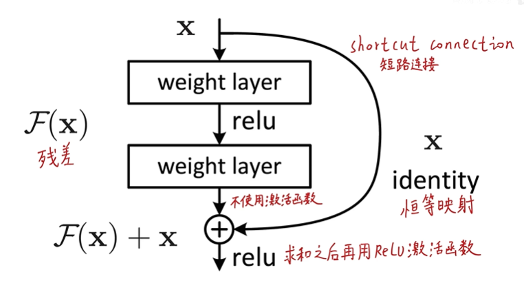
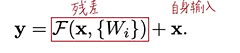
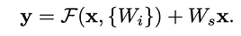

# ResNet网络论文笔记
* 论文的中文译文版可以参考 https://blog.csdn.net/wspba/article/details/57074389
> 本文主要内容来自B站同济子豪兄论文精讲系列视频
## 概述
ResNet模型是2015年ImageNet图像分类竞赛冠军，其首次在准确度上超过了人类的水平，同时其解决了网络退化问题（ResNet的深度是152层，远大于GoogleNet的22层和VGG的19层，网络可以提取出更深的特征），使得网络深度可以进行更多的叠加，使神经网络可以适应于更多的情况。
## ResNet的残差模块 
 
通过将输入恒等映射到输出，使得神经网络的拟合只需要拟合网络的残差而非拟合网络本身的全部底层规律。拟合残差最差也只会使得网络仅做恒等变换，不会使网络性能下降。
> 残差指预测值与真实值之间的偏差
## 残差模块可以解决网络退化问题的可能原因(存疑)
* 恒等映射这一路的梯度是1，则总梯度最起码是1，可以将深层梯度传给底层，防止出现梯度消失
* 类比其他模型：机器学习boosting方法(多个弱分类器拟合，后面的着重修正前一分类器的错误，完成后合并决策边界，形成一个强分类器)，残差也可以起到修正前面神经元错误的作用
* 传统线性结构网络难以拟合恒等映射,而ResNet模型可以自行决定是否修正残差，可以选择是否更新，一定程度上弥补了高度非线性造成的不可逆信息损失
* ResNet反向传播传回的梯度相关性好：随着网络加深，相邻像素的梯度相关性越来越低，最后接近白噪声。但ResNet梯度相关性衰减更慢，能保持梯度相关性
* ResNet相当于几个浅层网络的集成：每个节点有两条路，其n个节点有2^n个潜在路径(类似dropout)；测试时去掉某几个残差块后几乎不影响性能。其为非传统的并行结构
* skip connection可以实现不同分辨率特征的组合：恒等映射和残差块对应不同尺度的特征，其在求和时相当于进行了特征整合
* 还可以从数学角度进行解释(略)
* ~~作者自己的解释：没啥好解释的，实验结果就这样~~
---------------------------------
## VGG论文分析
* Abstract
  > * 构造了深度极深的网络(152层)，但是参数量仍旧少于VGG网络。网络越深，其能够提取特征的层次就越丰富
* Introduction
  > * 直接把网络堆深会遇到网络的梯度消失与梯度爆炸，这点可以使用网络的各种初始化和batch normalization解决。除此之外，还有臭名昭著的网络退化现象，其与梯度消失爆炸/网络过拟合问题不同，其在测试集和训练集上的表现均下降
  > * 使用ResNet的残差结构可以一定程度的解决网络退化的问题，其拟合恒等映射比传统网络更加容易。增加恒等映射路径对模型的计算复杂度几乎没有影响，模型仍旧可以使用损失函数和梯度下降求解
  > * 使用残差模块的网络更加易于优化与收敛
  > * 超深网络提取的特征更加易于迁移
* Deep Residual Learning
  > 1. Residual Learning
  > * 假设最终要学习到的完整映射为H(x),其可以被整个网络或者其中部分单元拟合
  >> 万能近似定理: 它声明了在给定网络具有足够多的隐藏单元的条件下，配备一个线性输出层和一个带有任何“挤压”性质的激活函数(如logistic sigmoid激活函数)的隐藏层的前馈神经网络，能够以任何想要的误差量近似任何从一个有限维度的空间映射到到另一个有限维度空间的Borel可测的函数
  > 拟合残差对神经网络来说更容易(多层神经网络很难拟合恒等映射)。在实际情况下，恒等映射多半并非为最优，后面的网络仅需拟合前面网络的输出与期望函数的残差。残差模块输出的响应更小(因为其仅需拟合残差，比完整映射幅度小很多)
  > 2. Identity Mapping by Shortcuts
  > * 在网络每一层都使用了残差模块，其数学表示为： 
   
  > * 在残差模块中，神经网络先处理一次，激活后再用网络处理一次，这一次不进行激活。偏置项在ResNet中并不重要，先忽略掉。（若卷积层后面加batch normalization层，则不需要模型的偏置项bias）最后将残差和输入逐元素对于相加，再对求和的结果进行一次非线性激活
  >> batch normalization会将输出的均值变成0，方差变成1
  > * Shortcut connections 并未引入额外参数和额外的计算复杂度，因此提供了有无残差的公平的对比实验的条件（加法在计算时引入的计算复杂度很小，基本可以忽略不计）
  > * X和F的维度必须一样，因此若网络进行了下采样，shortcut connection必须进行一次线性变换W（方阵）以满足维度相同的要求。此处不引入线性表换已经足够满足网络的性能要求，引入反而不经济，ResNet没有引入下采样和线性变换。 
   
  > * 残差模块分支最好起码两层，不然其线性度过高，在高维空间中始终为直线，对分类的效果会变差
  > * 此处演示的是全连接神经网络，但是其可以是卷积神经网络，残差分支可以表示为多层卷积，逐元素加法被表示为两个分支的feature map逐元素逐通道相加
  > 3. Network Architectures

